# 🌐 Nexus Web Hub

[](./LICENSE)
[](https://github.com/Tryboy869/nexus-web-hub)

> **La plateforme communautaire pour découvrir, publier et évaluer le meilleur du Web.**


---

## 🎯 Le Problème Qu'On Résout

Les stores d'applications (Google Play, App Store) sont réservés aux apps natives. Le Web est fragmenté : comment découvrir les meilleures **webapps, outils, jeux et APIs** ?

**Nexus Web Hub** est la réponse :

- ✅ **Store universel** pour tout ce qui fonctionne dans un navigateur
- ✅ **Visibilité méritocratique** (qualité, pas budget publicitaire)
- ✅ **Communauté auto-régulée** (testeurs badgés, avis vérifiés)
- ✅ **Gratuit et ouvert** (publier = gratuit, découvrir = gratuit)

---

## 🌟 Pourquoi Nexus Web Hub ?

| Caractéristique | Stores classiques | Product Hunt | **Nexus Web Hub** |
|-----------------|-------------------|--------------|-------------------|
| **Type de contenu** | Apps natives | Produits tech | **Webapps uniquement** ✅ |
| **Visibilité** | Pay-to-win | Gaming (upvotes) | **Méritocratique** ✅ |
| **Reviews** | Anonymes | Superficielles | **Testeurs badgés** ✅ |
| **Coût publication** | 25-99$/an | Gratuit mais ranking payant | **100% gratuit** ✅ |
| **Modération** | Opaque | Humaine lente | **Auto + communautaire** ✅ |
| **Collections** | Algorithme | Listes éditeurs | **Curation communautaire** ✅ |

**Verdict** : La première plateforme **Web-first, community-driven, quality-focused**.

---

## ✨ Fonctionnalités Principales

### 🔍 **Découverte Intelligente**

- **Catalogue universel** : Tous les types de webapps (jeux, outils, APIs, UI kits, sites créatifs)
- **Recherche sémantique** : Trouve par besoin ("créer un logo rapidement") pas juste par mots-clés
- **Filtres avancés** : Catégorie, note, date, trending
- **Collections curées** : Listes communautaires par thématiques


### ✍️ **Publication Simple**

- **Formulaire intuitif** : Nom, description, URL, catégorie → publié en 30 secondes
- **Modération automatique** : Vérification doublons, liens valides, contenu approprié
- **Aperçu instantané** : Iframe sécurisée + screenshot auto-généré
- **Édition libre** : Modifier/supprimer vos projets à tout moment

### ⭐ **Système d'Évaluation Professionnel**

- **Avis détaillés** : Texte + note étoilée + vote "utile"
- **Testeurs badgés** :   
- **Score de fiabilité** : Uptime, sécurité, note communauté
- **Marketplace testers** : Engagez des testeurs légendaires pour audits payants

### 🏆 **Gamification & Communauté**

**Progression Testeurs** :
```
🔰 Beginner Tester → ⚡ Pro Tester → 👑 Legendary Tester
(10 avis)          (50 avis + 70% utiles)  (200 avis + 80% utiles)
```

**Badges Disponibles** :

    

---

## 🚀 Démarrage Rapide

### Pour les Utilisateurs

1. **Découvrir** : Visitez [nexus-web-hub.onrender.com](https://nexus-web-hub.onrender.com)
2. **Explorer** : Parcourez le catalogue (aucun compte requis)
3. **S'inscrire** : Créez un compte pour publier et évaluer

### Pour les Créateurs

1. **Publier** : Cliquez "Soumettre votre webapp"
2. **Remplir** : Nom, URL (HTTPS), description
3. **Modération** : Votre projet sera validé sous 48h

### Pour les Développeurs

```bash
git clone https://github.com/Tryboy869/nexus-web-hub.git
cd nexus-web-hub

pip install -r requirements.txt

cp .env.example .env

python server.py
```

Ouvrir http://localhost:8000

**Stack** : 
- **Frontend** : HTML + CSS + JavaScript vanilla (mobile-first, bilinguisme FR/EN, thème auto)
- **Backend** : Python + Flask (ultra-minimal, compatible Render Free)
- **Database** : Turso (SQLite distribué) / Supabase (collaborateurs)

[📖 Guide complet →](./SETUP.md)

## 🏗️ Architecture

**Nexus Web Hub** suit la philosophie **NEXUS AXION 3.5** :

```
nexus-web-hub/
├── index.html           # Frontend complet (HTML + CSS + JS vanilla)
├── server.py            # Backend Flask ultra-minimal
├── requirements.txt     # 4 lignes (Flask, Flask-CORS, libsql, dotenv)
├── .env.example         # Template variables
├── .env                 # Variables locales (pas commit)
├── DEPLOYMENT.md        # Guide déploiement production
├── SETUP.md             # Guide installation locale
└── assets/              # SVG animations & badges
    ├── logos/
    ├── badges/
    │   └── system/
    │       ├── badge-admin.svg
    │       ├── badge-verified-creator.svg
    │       ├── badge-beginner-tester.svg
    │       ├── badge-pro-tester.svg
    │       └── badge-legendary-tester.svg
    ├── storyline/
    ├── contributors/
    └── icons/
```

**Principes** :
- ✅ **2 fichiers code** maximum (frontend + backend)
- ✅ **Mobile-first** responsive design
- ✅ **Bilinguisme** FR/EN avec détection auto
- ✅ **Thème auto** Light/Dark selon système utilisateur
- ✅ **Déploiement instant** (Render, Railway, Vercel)
- ✅ **Zéro configuration** complexe
- ✅ **Production-ready** immédiatement

[Lire la documentation architecture complète →](./docs/ARCHITECTURE.md)

---

## 💎 Philosophie & Valeurs

### 🎯 **Méritocracie Pure**

> "La visibilité se gagne par la qualité, jamais par le budget."

- **Pas de ranking payant** : Tous les projets ont la même chance d'être découverts
- **Algorithme transparent** : Score calculé sur uptime, sécurité, notes réelles
- **Pas de sponsored posts** : Zéro publicité déguisée

### 🤝 **Communauté Auto-Régulée**

- **Testeurs badgés** : Progression méritée (avis utiles)
- **Signalements communautaires** : Jury aléatoire pour décisions
- **Pénalités transparentes** : Avis fake = badge perdu + ban 1 an

### 🚀 **Accessible à Tous**

- **Publier = gratuit** : Aucun coût pour soumettre votre projet
- **Découvrir = gratuit** : Catalogue ouvert à tous
- **Monétisation éthique** : Options pro pour créateurs avancés (analytics, curation)

---

## 💰 Modèle Économique (Éthique)

### ✅ **Gratuit pour Toujours**

- Publication illimitée
- Découverte du catalogue
- Avis et notes
- Collections personnelles (1 gratuite)

### 💎 **Nexus Pro (5$/mois - Optionnel)**

**Pour créateurs actifs** :
- Analytics avancées (origine trafic, taux de conversion)
- A/B testing descriptions
- 3 collections curées publiques
- Badge "Soutient Nexus 💎"
- Support prioritaire

### 🏢 **Enterprise (25$/mois)**

**Pour équipes/entreprises** :
- 10 collections curées
- Collaboration multi-utilisateurs
- API access privé
- White-label collections
- Onboarding dédié

### 🛠️ **Services Connexes (Séparés)**

- **Nexus Deploy** : Hébergement optimisé webapps
- **Nexus Analytics** : Analytics respectueux vie privée
- **Nexus CDN** : CDN rapide pour assets

**Principe sacré** : La plateforme reste neutre. Les services techniques financent le projet sans biaiser la visibilité.

---

## 🛠️ Technologies

### Frontend
- **HTML5** + CSS3 (variables, grid, flexbox)
- **JavaScript ES6+** (vanilla, pas de framework)
- **Mobile-first** responsive
- **Bilinguisme** FR/EN automatique
- **Thème auto** Light/Dark (prefers-color-scheme)

### Backend
- **Python 3.11** + Flask 3.0
- **Turso** (SQLite distribué, production)
- **SQLite** (développement local)
- **libsql-experimental** (client Turso)
- **Flask-CORS** (API CORS)

### Base de Données
- **5 tables** : users, webapps, reviews, reports, collections
- **Auth** : Hash SHA256 + tokens sécurisés
- **Rôles** : user, admin
- **Migration** : Support Supabase pour collaborateurs

### Déploiement
- **Frontend** : Static serve via Flask
- **Backend** : Render Free Tier (compatible)
- **Database** : Turso (global edge, gratuit)
- **CDN** : Cloudflare (assets)

---

## 🤝 Contribution

**Nexus Web Hub** accepte les contributions sur le **code de la plateforme uniquement**.

**Vous pouvez contribuer sur** :
- ✅ Amélioration UI/UX (HTML/CSS/JS)
- ✅ Optimisation performance (backend Flask)
- ✅ Corrections bugs
- ✅ Tests
- ✅ Documentation

**Vous NE pouvez PAS** :
- ❌ Soumettre des webapps via PR (utilisez le formulaire)
- ❌ Modifier le catalogue directement
- ❌ Changer l'algorithme de ranking sans validation

[Lire le guide complet de contribution →](./CONTRIBUTING.md)

### Système Admin

**Création admin sécurisée** :
```bash
curl -X POST https://nexus-web-hub.onrender.com/api/admin/create \
  -H "Content-Type: application/json" \
  -d '{
    "admin_secret": "VOTRE_SECRET",
    "name": "Admin Name",
    "email": "admin@example.com",
    "password": "SecurePassword123"
  }'
```

**Badge admin** : `./assets/badges/system/badge-admin.svg` (or avec couronne)

**Permissions admin** :
- Modérer les signalements (`/api/admin/reports`)
- Approuver/rejeter webapps (`/api/admin/webapps/:id/approve`)
- Créer d'autres admins (avec ADMIN_SECRET)

[Documentation complète admin →](./DEPLOYMENT.md#admin-system)

---

## 👥 Équipe & Contributeurs

### Fondateur

[](https://github.com/Tryboy869)

**Daouda Abdoul Anzize**  
CEO & Founder - Nexus Studio

- 🏆 Architecte logiciel
- 💎 Créateur NEXUS AXION
- 🚀 Visionnaire Web

📧 **Contact** :
- Pro : nexusstudio100@gmail.com
- Perso : anzizdaouda0@gmail.com
- GitHub : [@Tryboy869](https://github.com/Tryboy869)

### Contributeurs

*Aucun contributeur externe pour le moment. Soyez le premier !*

[Rejoindre l'équipe →](./CONTRIBUTING.md)

---

## 📚 Documentation

- [**Guide d'Architecture**](./docs/ARCHITECTURE.md) - Structure technique détaillée
- [**Guide API**](./docs/API.md) - Documentation endpoints REST
- [**Guide Modération**](./docs/MODERATION.md) - Règles et automatisation
- [**Guide Badges**](./docs/BADGES.md) - Système de progression
- [**FAQ**](./docs/FAQ.md) - Questions fréquentes

---

## 🗺️ Roadmap

### ✅ **Phase 1 : MVP (Actuel)**

- [x] Architecture backend/frontend
- [x] Système auth complet (signup/login)
- [x] Catalogue + recherche + filtres
- [x] Soumission webapps avec modération
- [x] Système admin sécurisé
- [x] Bilinguisme FR/EN
- [x] Thème auto Light/Dark
- [x] Mobile-first responsive
- [x] Base de données Turso
- [x] Reset database automatique
- [x] Migration Supabase préparée

### 📅 **Phase 2 : Communauté (Q1 2025)**

- [ ] Système badges complet (testeurs)
- [ ] Ratings/Avis avec dimensions multiples
- [ ] Profils utilisateurs enrichis
- [ ] Collections curées (1 gratuite, 3 Pro)
- [ ] Signalements communautaires
- [ ] Dashboard créateurs

### 📅 **Phase 3 : Marketplace (Q2 2025)**

- [ ] Marketplace testeurs légendaires
- [ ] API publique REST
- [ ] Analytics avancées (Pro)
- [ ] Abonnements (Nexus Pro 5€/mois)
- [ ] Système de paiement (Stripe)

### 📅 **Phase 4 : Écosystème (Q3 2025)**

- [ ] Nexus Deploy (hébergement)
- [ ] Nexus Analytics (privacy-first)
- [ ] PWA mobile
- [ ] Internationalisation (plus de langues)
- [ ] Système de badges NFT (optionnel)

---

## 📜 License

**Custom License** - Nexus Web Hub

Ce projet utilise une licence personnalisée pour protéger son modèle économique tout en restant ouvert :

**Vous POUVEZ** :
- ✅ Utiliser le code pour apprendre
- ✅ Contribuer au projet via PRs
- ✅ Fork pour usage personnel/éducatif
- ✅ Utiliser l'API publique

**Vous NE POUVEZ PAS** :
- ❌ Créer un clone commercial de Nexus Web Hub
- ❌ Revendre le code ou services dérivés
- ❌ Utiliser le nom/logo "Nexus Web Hub" sans autorisation

[Lire la licence complète →](./LICENSE)

---

## 🌟 Soutenir le Projet

**Nexus Web Hub** est gratuit et le restera. Vous pouvez nous soutenir en :

1. ⭐ **Starrant ce repo** (visibilité GitHub)
2. 💎 **Devenant Supporter** (badge + reconnaissance)
3. 🔗 **Partageant** la plateforme dans vos réseaux
4. 🐛 **Signalant des bugs** via Issues
5. 💡 **Proposant des idées** via Discussions

---

## 📧 Contact

**Questions ? Feedback ? Partenariats ?**

- **Email pro** : nexusstudio100@gmail.com
- **Email perso** : anzizdaouda0@gmail.com
- **GitHub Issues** : [Ouvrir une issue](https://github.com/Tryboy869/nexus-web-hub/issues)
- **Discussions** : [Démarrer une discussion](https://github.com/Tryboy869/nexus-web-hub/discussions)

---

<div align="center">

**Fait avec ❤️ par [Nexus Studio](https://github.com/Tryboy869)**

*Découvrir. Publier. Évaluer. Le meilleur du Web, en un seul endroit.*


</div>