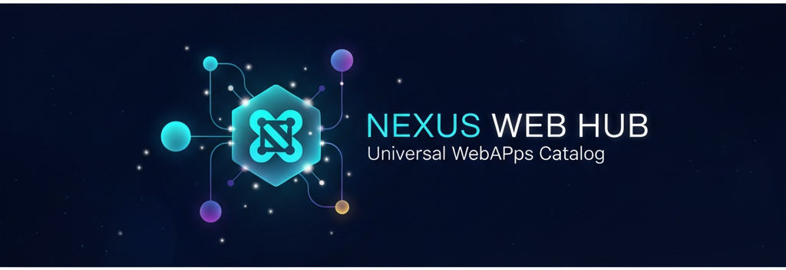

# 🌌 Nexus Web Hub

**Universal WebApps Catalog - Discover, Explore, and Share the Best Open Web Applications**



[](LICENSE)
[](https://nodejs.org/)
[](CONTRIBUTING.md)

> ⚠️ **Important Notice**: This project will include premium features in the future to ensure sustainability. Core catalog access will always remain free. See [Sustainability & Monetization](#-sustainability--monetization) section below.

---

## 🎯 Vision

Nexus Web Hub is an open-source platform that aims to become the **universal catalog** for web applications. Unlike closed app stores, we believe in:

- **🌍 Openness**: Anyone can submit and discover WebApps
- **🔓 Freedom**: No gatekeeping, no approval delays
- **💎 Quality**: Community-driven ratings and reviews
- **🚀 Innovation**: Showcase the best of the open web
- **🤝 Sustainability**: Building a financially sustainable platform without compromising our values

### Our Core Commitment

**What will ALWAYS be free:**
- ✅ Full access to the entire WebApp catalog
- ✅ Submitting your WebApps
- ✅ Rating and reviewing WebApps
- ✅ Using the public API (with fair rate limits)
- ✅ Contributing to the codebase

**What we will NEVER do:**
- ❌ Paid placement or featured listings
- ❌ Advertising-based monetization
- ❌ Selling user data
- ❌ Biasing search results based on payment
- ❌ Paywall on core catalog access

---

## ✨ Features

### For Users
- 🔍 **Advanced Search & Filtering**: Find WebApps by type, tags, popularity
- ⭐ **Rating System**: Rate and review your favorite apps
- 🏆 **Badge System**: Discover highly-rated and popular apps
- 🎲 **Surprise Me**: Random discovery for exploration
- 📊 **Real-time Stats**: Track platform growth
- 🖼️ **Live Previews**: See WebApps in action via iframe

### For Developers
- 📝 **Easy Submission**: Submit your WebApp via web form
- ⚡ **Instant Validation**: Automatic URL checking and screenshot capture
- 🤖 **Auto-approval**: No manual review required
- 💻 **Open Source Friendly**: Special badges for GitHub projects
- 📈 **Analytics**: Track views and engagement

### Technical
- 🗄️ **Persistent Database**: Turso (SQLite) for reliability
- 🔒 **Security**: Rate limiting, input validation, XSS protection
- 🚀 **Performance**: Optimized queries and caching
- 📱 **Responsive**: Works on all devices
- 🎨 **Modern UI**: Beautiful constellation-themed design

---

## 🚀 Quick Start

### Prerequisites
- **Node.js** 18+ ([Download](https://nodejs.org/))
- **Turso Account** ([Sign up free](https://turso.tech/))

### Installation

1. **Clone the repository**
```bash
git clone https://github.com/Tryboy869/nexus-web-hub.git
cd nexus-web-hub
```

2. **Install dependencies**
```bash
npm install
```

3. **Configure environment**
```bash
cp .env.example .env
# Edit .env with your Turso credentials
```

4. **Start the server**
```bash
npm start
```

5. **Open your browser**
```
http://localhost:3000
```

---

## 🔧 Configuration

### Environment Variables

Create a `.env` file with the following:

```env
# Required
PORT=3000
TURSO_DATABASE_URL=libsql://your-database.turso.io
TURSO_AUTH_TOKEN=your-token-here

# Optional
NODE_ENV=production
```

### Turso Database Setup

1. **Install Turso CLI**
```bash
curl -sSfL https://get.tur.so/install.sh | bash
```

2. **Create database**
```bash
turso db create nexus-web-hub
```

3. **Get credentials**
```bash
turso db show nexus-web-hub --url
turso db tokens create nexus-web-hub
```

4. **Add to `.env`**

---

## 📚 API Documentation

### Public Endpoints

#### Get All WebApps
```http
GET /api/webapps?type=game&sort=popular&limit=50
```

**Query Parameters:**
- `type`: Filter by type (game, tool, api, design, etc.)
- `sort`: Sort by (recent, popular, name)
- `search`: Search by name or description
- `tag`: Filter by tag
- `limit`: Results per page (default: 50)
- `offset`: Pagination offset

**Response:**
```json
{
  "success": true,
  "data": [
    {
      "id": "app-123",
      "name": "Awesome WebApp",
      "developer": "John Doe",
      "url": "https://example.com",
      "description_short": "A great webapp",
      "type": "tool",
      "tags": ["productivity", "open-source"],
      "rating": 4.5,
      "rating_count": 42,
      "views": 1337,
      "badges": ["highly_rated", "open_source"]
    }
  ]
}
```

#### Get Single WebApp
```http
GET /api/webapps/{id}
```

#### Submit WebApp
```http
POST /api/webapps/submit
Content-Type: application/json

{
  "name": "My WebApp",
  "developer": "Jane Dev",
  "url": "https://myapp.com",
  "description_short": "Description here",
  "type": "tool",
  "tags": ["productivity", "web"]
}
```

#### Submit Rating
```http
POST /api/ratings
Content-Type: application/json

{
  "webapp_id": "app-123",
  "rating": 5
}
```

#### Submit Review
```http
POST /api/reviews
Content-Type: application/json

{
  "webapp_id": "app-123",
  "user_name": "John",
  "comment": "Great app!"
}
```

#### Get Stats
```http
GET /api/stats
```

---

## 🎨 Customization

### Theme Colors

Edit the CSS variables in `public/index.html`:

```css
:root {
  --bg-primary: #0a0e27;
  --accent-cyan: #00D9FF;
  --accent-violet: #8A2BE2;
  --accent-gold: #FFD700;
}
```

### Badge System

Add custom badges in `src/app.js`:

```javascript
async function awardBadges(webappId) {
  // Add your custom badge logic
  if (someCondition) {
    badges.push('your_badge');
  }
}
```

---

## 🚀 Deployment

### Deploy to Render

1. **Create account**: [render.com](https://render.com)

2. **New Web Service**:
   - Connect your GitHub repo
   - Build Command: `npm install`
   - Start Command: `npm start`

3. **Environment Variables**:
   - Add `TURSO_DATABASE_URL`
   - Add `TURSO_AUTH_TOKEN`

4. **Deploy!**

### Deploy to Railway

1. **Create account**: [railway.app](https://railway.app)

2. **New Project**:
   - Import from GitHub
   - Add environment variables

3. **Deploy!**

### Deploy to Fly.io

```bash
# Install Fly CLI
curl -L https://fly.io/install.sh | sh

# Launch app
fly launch

# Set secrets
fly secrets set TURSO_DATABASE_URL=your-url
fly secrets set TURSO_AUTH_TOKEN=your-token

# Deploy
fly deploy
```

---

## 🤝 Contributing

We welcome contributions! See [CONTRIBUTING.md](CONTRIBUTING.md) for guidelines.

### Ways to Contribute

1. 🐛 **Report Bugs**: Open an issue
2. 💡 **Suggest Features**: Share your ideas
3. 🔧 **Fix Issues**: Submit a PR
4. 📝 **Improve Docs**: Help others understand
5. 🎨 **Design**: Improve UI/UX
6. 🌍 **Translate**: Add language support

---

## 📊 Project Stats

- **Total WebApps**: 0 (just launched!)
- **Contributors**: 1 (you could be next!)
- **Stars**: ⭐ (give us one!)
- **Forks**: 🍴 (fork and customize!)

---

## 💰 Sustainability & Monetization

### Our Philosophy

Nexus Web Hub is committed to remaining a **fair and accessible platform** for all. To ensure long-term sustainability and continuous development, we plan to introduce **optional premium features** in the future.

### Transparency Promise

**Current Status**: 100% Free  
**Future Plan**: Hybrid model (Free Core + Optional Premium)

**Our Commitments:**
1. 📖 **Full Transparency**: Any monetization will be clearly communicated
2. 🆓 **Free Core**: Catalog access and basic features will always be free
3. 🚫 **No Pay-to-Win**: Rankings and visibility based solely on quality and engagement
4. 💎 **Value-Driven**: Premium features will provide genuine value, not artificial limitations
5. 👥 **Community First**: Major decisions will involve community feedback

### What Premium Might Include (Future)

While details are not finalized, premium features may include:
- 📊 Advanced analytics for WebApp creators
- 🎨 Enhanced customization options
- 🔌 Extended API access limits
- 🛠️ Professional tools and services
- ⚡ Priority support

**None of these will affect the core experience of discovering and using WebApps.**

### Why This Approach?

Building and maintaining a quality platform requires:
- 💻 Infrastructure costs (servers, databases, CDN)
- 🔧 Ongoing development and maintenance
- 🛡️ Security and moderation
- 📈 Scaling as the community grows
- 👨‍💻 Compensating maintainers and contributors

By monetizing optional premium features (not the core catalog), we can:
- ✅ Keep the platform accessible to everyone
- ✅ Sustain long-term development
- ✅ Remain independent from advertisers
- ✅ Reward maintainers fairly
- ✅ Invest in better features for all users

### Inspired By

We follow the model of successful open-source projects like:
- **GitLab**: Open core + Enterprise features
- **Ghost**: Self-hosted free + Managed hosting premium
- **Discourse**: Free software + Paid hosting/support

---

## 📜 License

This project uses a **dual licensing model**:

- **Core Platform**: MIT License (see [LICENSE](LICENSE))
- **Future Premium Features**: May use commercial licensing

By contributing to this project, you agree that:
- Your contributions to the core platform are licensed under MIT
- The project may include premium features in the future
- You do not expect compensation for contributions unless explicitly agreed
- You support the sustainability model described above

See [LICENSE](LICENSE) and [CONTRIBUTING.md](CONTRIBUTING.md) for full details.

---

## 👨‍💻 Author

**DAOUDA Abdoul Anzize**
- 🏢 CEO of **Nexus Studio**
- 💼 GitHub: [@Tryboy869](https://github.com/Tryboy869)
- 📧 Email: anzizdaouda0@gmail.com
- 🏢 Business: nexusstudio100@gmail.com
- 🌐 Organization: [Nexus Studio](https://github.com/nexus-studio)

---

## 🙏 Acknowledgments

- Design inspired by modern web3 aesthetics
- Built with passion for the open web by **Nexus Studio**
- Community-driven development

---

## 📞 Support

- 📧 Personal: anzizdaouda0@gmail.com
- 🏢 Business: nexusstudio100@gmail.com
- 💬 Discord: [Join our community](https://discord.gg/nexus-web-hub)
- 🐛 Issues: [GitHub Issues](https://github.com/Tryboy869/nexus-web-hub/issues)

---

<div align="center">

**🌌 Built with ❤️ by [Nexus Studio](https://github.com/Tryboy869)**

**DAOUDA Abdoul Anzize - CEO**

[Website](https://nexus-web-hub.com) • [Documentation](https://docs.nexus-web-hub.com) • [API](https://api.nexus-web-hub.com)

</div>